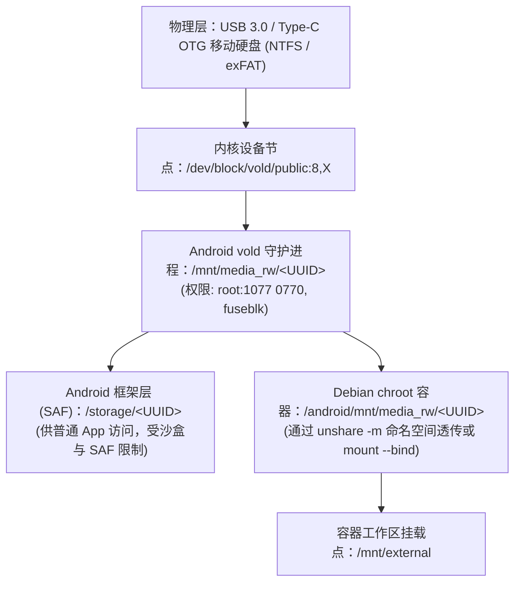

# Termux Debian 移动硬盘与外置存储读写指南

在 Android 设备（手机 / 平板）上通过 Termux 部署 Debian `chroot` 容器后，外接移动硬盘（USB OTG）是扩展巨额存储空间（如备份数据、大型语言模型权重、开发数据集）的关键手段。

然而，Android 系统的卷管理守护进程（`vold`）、FUSE `fuseblk` 驱动、Linux Mount Namespace 私有隔离、NTFS POSIX 权限伪造以及 Windows 脏位（Dirty Bit）等多层抽象交织，极易导致「插上盘却在容器中找不到」、「权限全开但 SSH 私钥报错拒连」、「写入缓存未刷导致数据损坏」等隐蔽问题。

本 skill 梳理在 Termux Debian chroot 环境下读写移动硬盘的底层架构、踩坑根因与生产级操作方案。

---

## 1. 核心架构认知：Android 外置存储的四层视图

在排查或挂载前，必须理清外接存储在整个系统栈中的四层拓扑结构：



### 1.1 关键权限边界
* **宿主 Termux 普通用户（非 Root）**：
  * 受 Android 11+ Scoped Storage 限制，即使执行 `termux-setup-storage`，也**无法直接**通过 Shell 路径读取 `/storage/<UUID>` 或 `/mnt/media_rw/<UUID>`（报 `Permission denied`），必须经由 Android Java SAF 选择器。
* **Debian root 容器**：
  * 拥有真实的 `uid=0(root)`，直接穿透 Android DAC 门禁。
  * 可以以原生 POSIX 速度直接读写底层 `/mnt/media_rw/<UUID>`，绕过一切 Android 应用层 API 限制。

---

## 2. 核心踩坑与底层取证分析

### 2.1 踩坑一：Mount Namespace 隔离导致的热插拔（Hotplug）失明
* **现象**：
  在进入 Debian 容器**之后**才插入移动硬盘，Android 通知栏提示「已连接 USB 设备」，但在 Debian 中查看 `/android/mnt/media_rw/` 为空，找不到新盘。
* **底层根因**：
  * Debian 启动脚本使用了 `unshare -m` 创建了独立的 Mount Namespace，并设置了 `mount -o rprivate none /`。
  * `rprivate` 阻断了挂载传播。Android `vold` 是在**宿主命名空间**中完成挂载的，该挂载事件无法自动推送到已隔离的 Debian 命名空间。
* **解决方案**：
  * **方案 A（无需退出会话）**：利用特权 `nsenter` 穿透宿主命名空间进行动态挂载（见下文配套脚本）。
  * **方案 B（最简单）**：将移动硬盘连接好之后，再执行 `debian` 进入容器；或者在容器内 `exit` 后重新进入。

### 2.2 踩坑二：双重挂载（Dual-Mount / EBUSY）与文件系统损坏隐患
* **现象**：
  在 Debian 内尝试用 `ntfs-3g /android/dev/block/vold/public:8,97 /mnt/external` 重新挂载，报错设备繁忙（`Device or resource busy`）或发生元数据损坏。
* **底层根因**：
  * Android 宿主的 `vold` 已经将该块设备挂载为 `fuseblk`。
  * Linux 坚决禁止两个独立文件系统驱动同时以读写模式挂载同一个物理块设备，否则会导致极严重的缓存不同步与数据踩踏。
* **铁律**：**永远复用（Bind-Mount）Android 既有的 `/android/mnt/media_rw/<UUID>` 挂载点**，切勿脱离 Android 系统重复对底层块设备执行二次挂载。

### 2.3 踩坑三：NTFS 权限退化导致 SSH 私钥与脚本失效
* **现象**：
  将包含 `.ssh/id_ed25519` 的目录存放在移动硬盘上，直接软链接或拷贝至 `~/.ssh` 后，SSH 连接报错：
  ```text
  Permissions 0770 for 'id_ed25519' are too open.
  ```
  在移动硬盘上执行 `chmod 600 id_ed25519`，命令退出码为 0，但 `ls -la` 权限位依然是 `770`（`root:1077`），无法改变。
* **底层根因**：
  * NTFS 不原生支持 Linux POSIX 所有者与权限位。Android FUSE 驱动在挂载时强制固化了 `uid=0,gid=1077,mode=770`。
* **规范操作**：
  * **密钥与权限敏感文件必须存放在 `.tar` 包内**（例如 `ssh-backup.tar`）。
  * 部署时解压到 Debian 本地的 Linux 文件系统（如 `/root/.ssh`），再赋予 `600`/`700` 权限。详见 [ntfs-posix-and-dirty-bits.md](references/ntfs-posix-and-dirty-bits.md)。

### 2.4 踩坑四：Windows 快速启动导致移动硬盘在 Android 下被降级为只读（RO）
* **现象**：
  移动硬盘可以在 Debian 中列出文件，但无法新建或修改文件，报错 `Read-only file system`。
* **底层根因**：
  * 移动硬盘从 Windows 电脑拔出时未点击「安全删除硬件」，或 Windows 开启了快速启动（Fast Startup）。
  * NTFS 分区带有休眠锁或脏位（Dirty Bit），Linux 内核为保护数据安全，主动降级为只读挂载。
* **排查与解决**：
  * 检查挂载参数：`mount | grep media_rw`，若包含 `,ro,` 即说明触发了保护。
  * 在 Windows 中彻底关闭快速启动（`powercfg /h off`），或使用 `ntfsfix -d` 清除日志脏位。

### 2.5 踩坑五：直接拔出数据线导致的数据损坏与页面缓存丢失
* **现象**：
  刚刚写入移动硬盘的大文件，拔出后再插入，发现文件大小为 0 或文件系统元数据损毁。
* **底层根因**：
  * Linux 内核对大容量块设备具有强烈的内存页写回缓存（Page Cache Writeback）。
  * 命令执行完毕仅代表数据已写入 RAM 缓存，未真正刷入磁盘磁道或闪存介质。
* **规范操作**：
  * 拔盘前必须执行 `sync`，并执行 `umount` 安全卸载。

---

## 3. 标准操作指南与生产脚本

### 3.1 一键探测并挂载移动硬盘
使用本 skill 附带的 [`scripts/mount-external-drive.sh`](scripts/mount-external-drive.sh)，自动兼容预挂载与热插拔命名空间穿透：

```bash
# 挂载到默认的 /mnt/external
bash /my-config-private/agent/skills/termux-debian-external-drive/scripts/mount-external-drive.sh

# 或者指定自定义挂载点
bash /my-config-private/agent/skills/termux-debian-external-drive/scripts/mount-external-drive.sh /mnt/my-hdd
```

### 3.2 手动标准挂载命令（备查）
在 Debian root 终端中直接执行：

```bash
# 1. 查找 Android 挂载的 UUID
UUID=$(ls /android/mnt/media_rw/ 2>/dev/null | grep -v 'placeholder' | head -n 1)

# 2. 创建标准挂载目录并绑定挂载
mkdir -p /mnt/external
mount --bind "/android/mnt/media_rw/$UUID" /mnt/external

# 3. 验证空间与读写
df -h /mnt/external
echo "test" > /mnt/external/.rw-check.tmp && rm /mnt/external/.rw-check.tmp
```

### 3.3 安全卸载与拔出
在物理断开移动硬盘前，执行 [`scripts/umount-external-drive.sh`](scripts/umount-external-drive.sh)：

```bash
# 安全卸载（自动检查进程占用并刷盘）
bash /my-config-private/agent/skills/termux-debian-external-drive/scripts/umount-external-drive.sh /mnt/external

# 若被后台进程占用，支持强制平滑解绑
bash /my-config-private/agent/skills/termux-debian-external-drive/scripts/umount-external-drive.sh /mnt/external --lazy
```

---

## 4. 诊断排错速查表

| 现象 | 排查命令 | 根本原因 | 解决办法 |
| :--- | :--- | :--- | :--- |
| **`/android/mnt/media_rw/` 为空** | `nsenter -t 1 -m /system/bin/mount \| grep media_rw` | 热插拔发生在容器启动后，受 `unshare -m` 隔离 | 使用 `mount-external-drive.sh` 脚本或重新进入 `debian` |
| **写入报 `Read-only file system`** | `mount \| grep media_rw` | Windows 快速启动脏位未释放，驱动安全降级为只读 | Windows 禁用休眠或在 Linux 执行 `ntfsfix -d` |
| **私钥报 `Permissions 0770 are too open`** | `ls -la <key-path>` | NTFS FUSE 驱动不支持 POSIX 权限修改 | 私钥必须封在 `.tar` 归档包中，解压至本地 ext4/f2fs 使用 |
| **卸载报 `target is busy`** | `fuser -m /mnt/external` | 终端工作目录或后台编辑器未释放盘内句柄 | `cd /root` 退出目录，或使用 `umount-external-drive.sh --lazy` |
| **移动硬盘频繁掉盘 / I/O error** | `dmesg \| tail -n 30` | 手机/平板 OTG 输出电流不足（尤其 2.5 寸机械硬盘） | 必须使用外接独立供电的 USB 扩展坞（Powered Hub） |
