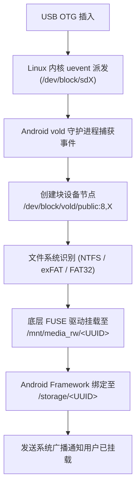

# Android vold、FUSE (fuseblk) 与权限架构取证分析

本文档深入解析 Android 卷管理守护进程（`vold`）对外接移动硬盘（USB OTG）的自动化挂载流程、底层文件系统驱动模式以及 UID/GID 权限掩码机制。

---

## 1. Android 外接存储的挂载生命周期

当移动硬盘或 U 盘插入 Android 设备的 USB-C / OTG 接口时，Android 系统的挂载分为以下内核与用户态阶段：



### 1.1 块设备节点命名规约
* **主磁盘节点**：`/dev/block/vold/disk:<major>,<minor>`（例如 `disk:8,96`，对应底层 SCSI 磁盘）。
* **分区卷节点**：`/dev/block/vold/public:<major>,<minor>`（例如 `public:8,97`）。
  * 这里的 `8,97` 代表 Linux 主设备号 8（SCSI 磁盘）与次设备号 97（对应 `sdg1` 或类似分区）。

---

## 2. 底层挂载属性与 FUSE 驱动模式

通过审查 `/proc/mounts`，Android 挂载 NTFS 移动硬盘的真实条目如下：

```text
/dev/block/vold/public:8,97 on /mnt/media_rw/<UUID> type fuseblk (rw,dirsync,nosuid,nodev,noexec,noatime,user_id=0,group_id=0,default_permissions,allow_other,blksize=4096)
```

### 2.1 核心参数深度剖析
1. **`type fuseblk`**：
   * Android 内核通常不直接编译完整的在内核态运行的 NTFS 驱动，而是通过用户态 FUSE（Filesystem in Userspace）驱动挂载。
   * `fuseblk` 是 Linux 内核专门为基于块设备的 FUSE 文件系统优化的挂载类型，支持页面缓存与按块 I/O。
2. **`dirsync`**：
   * 目录操作（如 `mkdir`、`rm`、`rename`）会同步写回存储介质，减少因意外拔出导致的目录树损坏，但小文件大量创建时会略微降低性能。
3. **`allow_other`**：
   * 允许挂载进程（`vold`，UID 0）以外的其他系统进程和容器进程通过 VFS 访问该文件系统。
4. **`noexec` 与 `nosuid`**：
   * Android 系统层面的安全加固策略：防止外部恶意存储中的可执行文件直接执行或提权。但在 Debian chroot 中，我们通常作为数据目录读写，如需执行脚本，建议从移动硬盘拷贝至本地 ext4/f2fs 文件系统。

---

## 3. 为什么 Termux 普通用户与 Debian root 表现截然不同？

### 3.1 GID 1077 与 Android 权限门禁
审查 `/mnt/media_rw/<UUID>` 的所有者与权限位：
```text
drwxrwx--- 1 root 1077 8192 Sep 26 17:35 /mnt/media_rw/<UUID>
```
* **UID 0**：`root`
* **GID 1077**：在 Android 中定义为 `AID_EXT_DATA_RW`（或关联的 `AID_MEDIA_RW = 1023`）。
* **模式 0770 (`rwxrwx---`)**：其他任何非 root 且未加入 GID 1077 的进程（包括 Termux 普通应用用户 `u0_aXXX`，UID/GID 通常为 10000+）**完全无权进入（`chmod -x` 效果）该目录**，执行 `ls` 必然报 `Permission denied`。

### 3.2 Debian chroot 的访问优势
当通过 `su` 启动 Debian chroot 容器时：
* 进程直接持有 `uid=0(root)`，Linux DAC 权限判定直接命中所有者读写执行权限。
* 彻底摆脱 Android 11+ Scoped Storage（分区存储框架 / SAF 存储访问框架）在应用层的 API 拦截，无需通过慢速且易崩溃的 DocumentFile Java ContentProvider，实现毫秒级原生 POSIX 读写。
