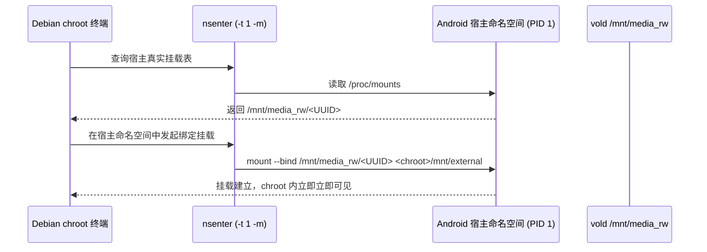

# Linux Mount Namespace 隔离与 USB 热插拔（Hotplug）取证分析

本文档解析当 Android 设备在运行 Debian chroot 期间插入移动硬盘时，为何容器内「看不见」新挂载，以及如何通过 `nsenter` 在不重启容器的情况下安全桥接挂载。

---

## 1. 现象复现：为什么插上硬盘后 Debian 目录是空的？

### 1.1 典型操作场景
1. 用户在 Termux 中执行 `debian` 进入 root 环境。
2. 启动后，用户随手将移动硬盘通过 OTG 数据线插入设备。
3. Android 系统顶部通知栏正常弹出「已连接 USB 存储设备」。
4. 但在 Debian 终端内查看：
   ```bash
   ls /android/mnt/media_rw/
   # 输出为空，或者只有旧目录！
   ```

---

## 2. 底层机理：Linux Mount Namespace 隔离与 `rprivate` 标记

在 Debian 启动脚本（`debian-chroot-launcher.sh`）中，为了防止 chroot 内的环境污染宿主 Android 系统的挂载表，执行了以下两条隔离指令：

```bash
exec /system/bin/unshare -m "$ROOT_SCRIPT" --root
...
/system/bin/mount -o rprivate none /
```

### 2.1 隔离链条分析
* **`unshare -m`（`CLONE_NEWNS`）**：
  * 创建了与 Android 宿主（PID 1 init 所在命名空间）相互独立的挂载命名空间（Mount Namespace）。
* **`-o rprivate none /`**：
  * 将容器内所有挂载点的共享模式递归设置为「私有」（Private）。
  * 在 Linux VFS 挂载传播树中，`private` 意味着**既不向外广播挂载事件（master），也不接收外部事件（slave）**。
* **时序决定的可见性**：
  * 启动前已挂载的目录：启动脚本通过扫描 `/proc/mounts` 显式执行了 `mount target destination`，因此可见。
  * 启动后插入的移动硬盘：Android `vold` 守护进程是在**宿主命名空间**中完成 `/mnt/media_rw/<UUID>` 挂载的。由于隔离门禁，该挂载事件被硬生生阻断在宿主命名空间内，不会被推送进 Debian 的命名空间中！

---

## 3. 生产级解决方案：动态命名空间穿透（`nsenter`）

无需退出当前 Debian 会话，也无需中断正在编译或执行的长任务。通过特权 `nsenter` 工具，可以直接穿透至宿主命名空间完成动态桥接：



### 3.1 实操命令

1. **探测宿主当前所有的外部介质**：
   ```bash
   nsenter -t 1 -m /system/bin/mount | grep -E '/mnt/media_rw/'
   ```
2. **在 Debian 内部直接绑定挂载**：
   如果 Debian 容器内的 `/android/dev/block/vold/public:*` 设备节点完备，可以直接获取块设备路径，或者将宿主路径直通挂载到 Debian 内部：
   ```bash
   CHROOT_HOST="<path-to-debian-root>"
   UUID="<device-uuid>"
   
   # 由宿主命名空间代理，将宿主上的 media_rw 直接绑定到 chroot 目录内
   nsenter -t 1 -m /system/bin/mount --bind "/mnt/media_rw/$UUID" "${CHROOT_HOST}/mnt/external"
   ```
3. **自动化封装**：
   直接使用封装好的配套脚本：
   ```bash
   bash /my-config-private/agent/skills/termux-debian-external-drive/scripts/mount-external-drive.sh /mnt/external
   ```
