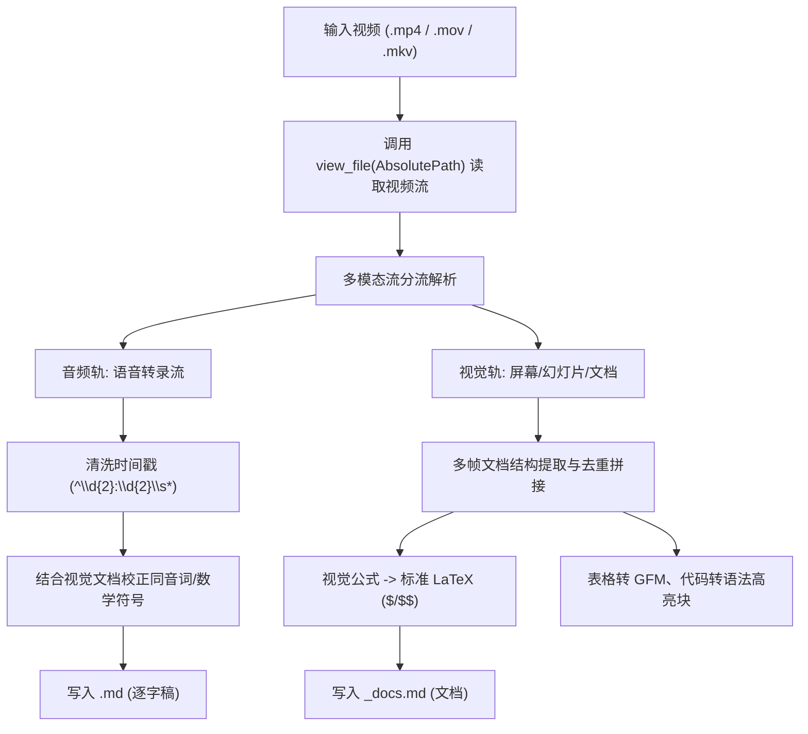

# 视频转逐字稿与视频内文档提取规范 (Video to Transcript & Document)

学术报告、教学课件、数模辅导、技术分享类视频通常包含两个独立且互补的维度：
1. **音频口播轨（作者逐字稿）**：讲师的口头阐述、背景补充、解题逻辑与临时推演。
2. **视频画面轨（视频内文档）**：屏幕上展示的 Word 文档、PPT 幻灯片、PDF 讲义、IDE 代码与图表。

常规视频转录工具往往顾此失彼：纯语音转录丢失全部视觉画面与公式排版；纯视频 OCR 则丢失讲解逻辑与口述细节。本技能定义了一套**双轨并行提取协议**，将视频完整重构为两份高保真 Markdown 文件。

> [!CAUTION]
> **绝对禁止在本地安装或调用 Whisper / Torch 等任何语音识别模型**：
> 视频的语音识别（ASR）与画面视觉理解必须完全由系统内置的多模态工具 `view_file` 完成。严禁执行任何诸如 `uv run --with openai-whisper`、`--with faster-whisper` 或 `uv pip install whisper` 的命令，严禁下载 PyTorch 及其庞大的 NVIDIA CUDA 运行时依赖！

---

## 1. 输出命名与文件规范

对于任意输入视频路径 `<path>/<video_name>.<ext>`（例如 `video_online/BV172Y36jEhB.mp4`）：

| 文件类型 | 目标文件路径 | 核心规范 |
| :--- | :--- | :--- |
| **作者逐字稿** | `<path>/<video_name>.md` | 提取口播音频，**默认去除时间戳**，保持纯净文本或自然段落，原话直录，不漏关键术语。 |
| **视频内文档** | `<path>/<video_name>_docs.md` | 提取画面课件/文档/代码，严格按照文档层级结构化排版，精准还原 **LaTeX 数学公式**、**GFM 表格**、**代码块**。 |

---

## 2. 提取与处理流程



### 2.1 步骤一：读取视频内容
直接使用系统内置的 `view_file` 工具读取视频的绝对路径：
- `view_file` 原生支持多模态视频文件解析，返回关键视觉帧（屏幕截图及 OCR 内容）与带时间戳的语音识别结果。
- 若返回内容发生截断（`truncated_fields` 提示），使用 `ContentOffset` 分批读完后续内容。
- **严禁引入第三方 ASR 依赖**：严禁在本地调用或安装 Whisper、faster-whisper、Torch 等，必须完全通过 `view_file` 的系统内置多模态能力获取逐字语音转录。

### 2.2 步骤二：提取并处理“作者逐字稿” (`<video_name>.md`)
1. **时间戳剥离**：
   - 默认剥离行首的播放时间戳（如 `00:00 `、`01:23 `、`[02:45]`）。
   - 保留作者原汁原味的口语表述、语气词、停顿节奏与强调内容。
2. **LaTeX 公式与数学符号格式化**：
   - **逐字稿中的所有数学变量、向量、坐标、角度、公式均须使用标准 LaTeX 语法，并用 `$`（行内）或 `$$`（独立块）包裹**（如 $x$ 轴、$\alpha_i$、$\delta = 1^\circ$、$S_i$、$D/2$、$\boldsymbol{u}_{i,-}$、$\Omega = \bigcap \Omega_i$）。
3. **多模态同音校对**：
   - 利用视频画面的专业词汇矫正语音识别易错词（例如语音听成“西格玛星”或“四合玛星”，结合屏幕文档准确核对为 `\sigma^*`；语音中的“S2”校对为检测点代号 $S_2$）。
4. **断句与行处理**：
   - 可保留单句换行，亦可按段落自然连接（消除字幕分片造成的半句话断行）。

### 2.3 步骤三：提取并重构“视频内文档” (`<video_name>_docs.md`)
1. **文档大纲层级**：
   - 根据屏幕中出现的题目、章节、标题，使用标准的 Markdown 标题 `#`、`##`、`###` 进行组织。
2. **LaTeX 数学公式精准还原**：
   - 行内公式使用 `$ ... $`，独立公式块使用 `$$ ... $$`。
   - 绝不使用模糊字符或 Unicode 降级符号（如将平方写成 `^2`、希腊字母写成英文字母），必须写为标准 LaTeX（如 `$S_i(x_i, y_i)$`、`\theta_i - \delta \le \theta_i^* \le \theta_i + \delta`）。
3. **表格与代码**：
   - 画面中的参数表、坐标表一律整理为标准 GFM 表格。
   - 画面中的编程代码（如 Python、MATLAB、C++）一律提取为带有相应语言标识的围栏代码块（````python ... ````）。
4. **图表与示意图**：
   - 若画面包含折线图、散点图、交会区域图，应提取其图题（如“图1 候选第二检测点定位效果排序图”）、坐标轴物理意义、关键数据点以及图面结论。

---

## 3. 辅助清洗脚本 (`clean_transcript.py`)

在技能目录的 `scripts/` 中提供了快速清洗与排版逐字稿的 Python 实用脚本。根据全局规范，始终前置 `PYTHONUNBUFFERED=1`（避免非 TTY 环境块缓冲导致输出延迟或空日志）并指定 `--python 3.12 python`：

```bash
# 1. 快速去除时间戳，保持原本单行结构（就地修改）
PYTHONUNBUFFERED=1 uv run --python 3.12 python $HOME/.gemini/config/skills/video-to-md/scripts/clean_transcript.py -i input_transcript.md

# 2. 去除时间戳并根据句末标点自动合并为自然段落
PYTHONUNBUFFERED=1 uv run --python 3.12 python $HOME/.gemini/config/skills/video-to-md/scripts/clean_transcript.py -i -p input_transcript.md

# 3. 指定输出到新文件
PYTHONUNBUFFERED=1 uv run --python 3.12 python $HOME/.gemini/config/skills/video-to-md/scripts/clean_transcript.py input_transcript.md -o cleaned_transcript.md
```

---

## 4. 常见场景与边界处理策略

| 场景 | 特征表现 | 处理方式 |
| :--- | :--- | :--- |
| **仅口播真人无课件** | 视频通篇仅有讲师出镜，无板书、幻灯片或屏幕文档 | 生成 `<video_name>.md`；在 `<video_name>_docs.md` 中说明“视频为纯口播无板书文档”，并提炼要点大纲。 |
| **无声演示/纯录屏** | 软件操作演示或静音课件展示，无语音旁白 | 生成 `<video_name>_docs.md`；在 `<video_name>.md` 中标注“本视频无语音讲解音轨”。 |
| **低清模糊公式** | 视频码率低导致部分下标模糊不可辨 | **画面+口播互校**：听取讲师念出的公式读音（如“二分之一D”、“x加y的平方”），补全高清 LaTeX 公式。 |
| **PPT页面来回切换** | 讲师讲解过程中反复跳转前页进行对比 | 以课件逻辑完整性为准，对重复出现的页面去重合并，按知识点完整结构呈现。 |

---

## 5. 常见坑点与注意事项 (Pitfalls & Best Practices)

1. **`uv run` 执行 Python 单行命令参数语法错误**：
   - ❌ **错误**：`uv run --python 3.12 -c "import ..."`（`uv` 会将 `-c` 误认为 `uv run` 自己的参数并报错 `unexpected argument '-c'`）。
   - ✅ **正确**：必须在选项后显式指定解释器 `python`：`PYTHONUNBUFFERED=1 uv run --python 3.12 python -c "import ..."`。

2. **第三方 Python OCR 包（如 `pytesseract`）缺少系统 C++ 二进制依赖**：
   - ❌ **错误**：尝试使用 `uv run --with pytesseract` 执行 OCR 识别，抛出 `FileNotFoundError: [Errno 2] No such file or directory: 'tesseract'`。
   - 💡 **原理**：`pytesseract` 仅仅是 Python 封装库，不会自动安装系统级 `tesseract` 二进制可执行文件。
   - ✅ **正确**：优先直接使用系统内置工具 `view_file` 读取视频或抽取关键帧图片，`view_file` 原生支持高质量多模态视觉图像解析；若需分帧保存，可使用 `ffmpeg` 提取帧至 `scratch/frames/` 后调用 `view_file` 查看图片。

3. **明令禁止使用任何语音识别库（严禁 Whisper / faster-whisper / Torch 等）**：
   - 🚫 **绝对禁止**：严禁执行诸如 `uv run --with openai-whisper`、`uv run --with faster-whisper`、`--with torch` 或任何本地加载语音转录模型的尝试。
   - 💡 **严重后果**：Whisper 深度绑定 PyTorch 与全套 NVIDIA CUDA 13 底层二进制库（如 `nvidia-cublas`, `nvidia-cudnn`, `triton` 等）。执行此类命令会强行触发数 GB 的庞大轮子包下载，严重塞爆磁盘、耗尽网络带宽并污染全局缓存。
   - ✅ **唯一合法方案**：视频的音频转录流**完全依托系统内置工具 `view_file(AbsolutePath)` 在多模态层直接提供**，原生输出带时间戳的精准语音识别结果，无需且严禁在本地拉取任何 ASR 模型运行。


